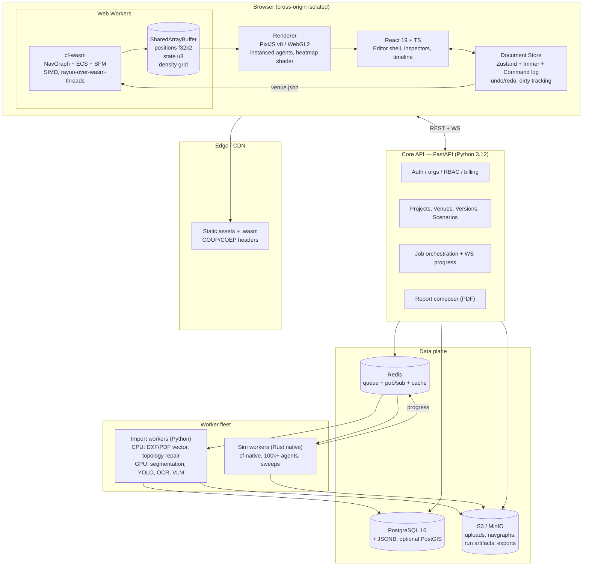

# CrowdFlow Studio — System Architecture

---

## 1. The load-bearing decision

**Author-time geometry and simulation-time geometry are different artifacts, joined by an
explicit, deterministic compile step.**

```
Venue Document  ──(compile)──►  NavGraph  ──(step)──►  Run artifacts
   editable                     immutable                immutable
   human-facing                 machine-facing           content-addressed
   versioned in Postgres        cached in object store   stored in object store
```

Everything else follows from this:

- Track A never has to understand triangulation; Track B never has to understand undo stacks.
- The compiler is the *only* place topology validity is enforced → one place to test.
- NavGraph is content-addressed by `hash(venue_version)`, so recompiles are free on cache hit.
- The same NavGraph feeds the WASM host and the native server host → identical results.
- A schema change is a versioned, reviewable event rather than a cross-team scramble.

The second load-bearing decision: **one Rust core, two hosts.** `cf-sim` has no knowledge of
WASM or of the server. `cf-wasm` and `cf-native` are thin shells. This is what makes
"design in browser, stress-test on server, get the same numbers" true rather than aspirational.

---

## 2. System diagram



---

## 3. Tech stack and why

| Layer | Choice | Rationale / rejected alternative |
|---|---|---|
| Sim core | **Rust** (stable, `no_std`-friendly crates where possible) | Memory safety in a long-running multi-agent loop; one source for WASM + native. Rejected C++ (two toolchains, UB risk), Go (GC pauses in the step loop). |
| Sim ECS | **Hand-rolled SoA arenas**, not Bevy/hecs | We need exact control of memory layout and SIMD lane alignment, and to avoid a scheduler we don't need. Bevy ECS pulls in a large dependency surface for WASM. Revisit only if archetype churn becomes real. |
| Browser exec | **WASM + `wasm-bindgen`**, threads via `wasm-bindgen-rayon`, `simd128` | Per source docs. Requires COOP/COEP (see §7). |
| Rendering | **PixiJS v8** (WebGPU with WebGL2 fallback) | Mature instanced-sprite path, good text/vector for editor chrome, avoids writing a renderer. Rejected raw WebGL (time), Three.js (3D overhead for a 2D app), SVG DOM (dies past ~5k nodes). |
| Frontend | **React 19 + TypeScript + Vite** | Team familiarity, ecosystem. Canvas is *outside* React's render loop — React drives chrome only. |
| Editor state | **Zustand + Immer + explicit Command log** | Command log gives undo/redo, audit trail, and a future path to CRDT co-editing for free. |
| Core API | **FastAPI (Python 3.12) + SQLAlchemy 2 + Pydantic v2** | Keeps backend mono-lingual with the ML pipeline; three languages total (Rust/TS/Python) instead of four. Rejected NestJS (would force a 4th runtime for ML). |
| Queue | **Redis + `arq`** | Sufficient for job counts at this scale, one fewer moving part than RabbitMQ/Celery. Revisit at >100 jobs/min. |
| DB | **PostgreSQL 16**, geometry as `JSONB`, PostGIS optional | Venue geometry is read whole, not spatially queried — JSONB is right. PostGIS only if we later do cross-venue spatial analytics. |
| Object store | **S3 / MinIO** | Uploads, NavGraph cache, run artifacts, exported PDFs. |
| ML runtime | **PyTorch** (train) + **ONNX Runtime INT8** (serve) | Train on free GPU, serve on CPU. Required by the free-tier constraint — see `07` §4.1. Detection models must be **RT-DETR / YOLOX (Apache-2.0)**, not Ultralytics YOLO (AGPL). |
| VLM | Behind a `VlmProvider` interface. Free/academic: Gemini free tier or local Qwen2.5-VL. Production: **Claude** (Sonnet 5 bulk, Opus 5 hard plans). | Semantics + validation only, never coordinates (`00-overview.md` C1) — which is exactly why a weaker free model degrades labels rather than corrupting geometry. |
| PDF report | **Typst** (Apache-2.0) + headless-Chromium raster of canvas | Deterministic, versionable report templates; fast compile. |
| Observability | OpenTelemetry → Grafana Cloud free tier (or self-hosted Grafana/Loki) | Sim runs and import jobs both need span-level timing. |
| CI | GitHub Actions (free on public repos); `cargo test`/`clippy`/`miri`, `vitest`/`playwright`, `pytest`/`ruff`, `cargo-deny` | Plus the determinism (§6) and licence gates. |
| Hosting | Cloudflare Pages + R2; Oracle Always Free ARM VM running docker-compose | Full rationale, allowances and paid successors in `07-infrastructure-and-cost.md`. |

---

## 4. Repository layout (monorepo)

```
crowdflow/
├── schema/                       # ★ the contract — owned jointly, changes need both leads
│   ├── venue.schema.json
│   ├── scenario.schema.json
│   ├── run-manifest.schema.json
│   └── codegen/                  # → TS types, Rust serde structs, Pydantic models
│
├── engine/                       # Track B — Rust workspace
│   ├── cf-schema/                # serde types generated from schema/, + migrations
│   ├── cf-geom/                  # primitives, polygon ops, snapping, robust predicates
│   ├── cf-navmesh/               # CDT, portals, funnel, flow fields, multi-floor links
│   ├── cf-compile/               # Venue Document → NavGraph
│   ├── cf-sim/                   # ECS, SFM+PBD, components, behaviours, event log
│   ├── cf-analytics/             # density grids, dwell, flowlines, bottlenecks, throughput
│   ├── cf-compliance/            # NFPA 101/130, Green Guide, NBC — rule engine
│   ├── cf-wasm/                  # wasm-bindgen host, SAB layout, worker protocol
│   ├── cf-native/                # CLI + worker binary, batch, Monte Carlo sweeps
│   └── cf-testkit/               # RiMEA cases, fundamental-diagram harness, golden runs
│
├── web/                          # Track A — frontend
│   ├── src/canvas/               # viewport, scene, hit-test, snapping, tools
│   ├── src/doc/                  # document store, commands, undo, validation
│   ├── src/components-library/   # intelligent asset definitions + inspectors
│   ├── src/scenario/             # arrival curve editor, populations, itineraries
│   ├── src/sim/                  # WASM worker bridge, playback, SAB views
│   ├── src/analysis/             # heatmap/flowline overlays, charts, timeline
│   ├── src/import/               # upload, layer mapping, scale calibration, review diff
│   └── src/report/               # report builder preview
│
├── services/
│   ├── api/                      # FastAPI core API
│   ├── import-worker/            # ingest → vectorize → repair → emit draft venue
│   │   ├── ingest/               # dxf, pdf_vector, pdf_raster, svg, image
│   │   ├── cv/                   # segmentation, symbols, ocr
│   │   ├── vlm/                  # semantic labelling + validation prompts
│   │   ├── vectorize/            # skeletonize, fit, merge, snap
│   │   └── topology/             # junction closing, arrangement, face extraction
│   └── report-worker/            # Typst compile + canvas raster
│
├── ml/                           # datasets, training, evals for the import models
│   ├── datasets/                 # CubiCasa5K adapters, synthetic generator, our labelled set
│   ├── training/
│   └── evals/                    # IoU, junction-F1, room-count accuracy dashboards
│
├── fixtures/                     # ★ shared test venues used by BOTH tracks
│   ├── unit/                     # corridor, T-junction, single-room-two-doors
│   ├── rimea/                     # RiMEA test cases 1–15
│   └── real/                     # anonymised real plans, with ground-truth vectors
│
├── infra/                        # terraform, k8s manifests, COOP/COEP edge config
└── docs/                         # this documentation set
```

`schema/` and `fixtures/` are the integration surface. Both tracks are blocked on `schema/`
in Phase 0 and on nothing else afterwards.

---

## 5. Data flow: the three main paths

### 5.1 Import path

```
upload ──► POST /v1/imports ──► S3 blob + job on Redis
                                     │
                              import-worker
                                     │
     ┌───────────────────────────────┴─────────────────────────────┐
     │ vector source (DXF/SVG/vector PDF)   raster source (PNG/scan) │
     │  ├ parse entities                     ├ deskew, denoise, tile │
     │  ├ layer→semantic mapping             ├ wall segmentation     │
     │  │  (heuristics + user confirm)       ├ symbol detection (YOLO)│
     │  └ direct polyline extraction         ├ OCR labels + dims      │
     │                                       ├ VLM semantic pass      │
     │                                       └ skeletonize → polylines │
     └───────────────────────────────┬─────────────────────────────┘
                                     ▼
                       scale calibration (OCR dims / door prior / user 2-point)
                                     ▼
                       topology repair (snap, extend, close L/T, de-sliver,
                                        planar arrangement, face → rooms)
                                     ▼
                       draft venue.json + per-element confidence
                                     ▼
                       UI review: accept / reject / edit as a diff
                                     ▼
                       POST /v1/imports/:id/accept → venue version
```

**Nothing from the AI path is auto-committed.** The output is always a reviewable proposal
layer. This is both a quality decision and a liability decision.

### 5.2 Interactive simulation path (browser)

```
Document Store ──serialize──► worker.postMessage(venue.json, scenario.json)
                                        │
                        cf-wasm: compile() → NavGraph  (cached by content hash in IndexedDB)
                                        │
                        init ECS: spawn schedules, flow fields per goal
                                        │
   ┌────────────────── fixed-step loop, dt = 0.05 s ──────────────────┐
   │ rebuild spatial hash → neighbour query → SFM forces →            │
   │ integrate → PBD contact resolve → component service tick →       │
   │ behaviour tick (reroute, queue, dwell) → analytics accumulate    │
   └──────────────────────────┬───────────────────────────────────────┘
                              │ writes into SharedArrayBuffer (double-buffered)
                              ▼
   main thread: rAF → read SAB → upload to GPU instance buffer → draw (1 draw call)
```

The main thread never blocks on the sim. If the sim runs slower than realtime, playback
reports a speed factor; if faster, it throttles to the requested playback rate.

### 5.3 Batch simulation path (server)

Same NavGraph, same `cf-sim`, `cf-native` host. Used for: >25k agents, Monte Carlo
seed sweeps, parameter sweeps (e.g. "gate count 4→12"), and the final report run of record.
Progress streams over Redis pub/sub → WS → UI. Artifacts land in S3.

---

## 6. Cross-track contracts and gates

Three CI gates enforce the architecture rather than trusting discipline:

**G1 — Schema gate.** `schema/*.json` changes must regenerate TS/Rust/Pydantic types and pass
round-trip tests in all three. A breaking change requires a `schemaVersion` bump plus a
migration in `cf-schema/migrations/`. PR must be approved by both track leads.

**G2 — Determinism gate.** `fixtures/` golden runs execute on native x86-64, native aarch64,
and wasm32. All three must produce **bit-identical** event logs and final positions. This is
what makes "the server run and the browser run agree" a fact. Enforcement details in
`04-track-b-simulation-engine.md` §5.

**G3 — Performance gate.** Benchmark suite runs on every PR to `cf-sim`; a >5% regression on
agents-per-second at the reference scenes fails the build. Numbers tracked over time, not
just pass/fail.

---

## 7. Deployment and the cross-origin isolation constraint

WASM threads need `SharedArrayBuffer`, which needs the app served with:

```
Cross-Origin-Opener-Policy: same-origin
Cross-Origin-Embedder-Policy: require-corp
```

Consequences we must design around now, not discover later:

- Every cross-origin asset (fonts, map tiles, analytics, Stripe iframes) must send
  `Cross-Origin-Resource-Policy: cross-origin` or be self-hosted. **Default to self-hosting
  everything**; audit third-party embeds at design time.
- Billing/auth widgets that can't comply move to a **non-isolated subdomain**
  (`billing.crowdflow.app`) and the editor stays isolated.
- Ship a **feature-detected single-threaded fallback** (`crossOriginIsolated === false`):
  same engine, `rayon` disabled, agent cap lowered, a visible banner. Never a hard failure.

Environments: `dev` (local docker-compose: postgres, redis, minio, api, web) →
`shared` (single Oracle Always Free ARM VM running the same compose file; Cloudflare Pages + R2
for static and object storage) → `prod` (containers on managed compute, HPA on the sim/import
queues, optional GPU node pool).

The free-tier build is not a downgraded variant — it is the same compose file on a smaller host,
which is why promotion to paid infrastructure is a config change. Concrete providers, allowances,
fallbacks and the bootstrap checklist are in `07-infrastructure-and-cost.md`.

**Verify cross-origin isolation in P0 week 1**, before A1 begins. A `crossOriginIsolated === true`
smoke test on a deployed Pages preview is a 30-minute task that de-risks the entire engine
host design.

---

## 8. API surface (v1 sketch)

```http
POST   /v1/projects                          → {project}
GET    /v1/projects/:id
POST   /v1/venues                            {project_id, name}          → {venue}
POST   /v1/venues/:id/versions               {doc, parent_version, msg}  → {version}   # immutable
GET    /v1/venues/:id/versions               ?limit                       → DAG listing
GET    /v1/venues/:id/versions/:ver          → {doc, manifest}
POST   /v1/venues/:id/versions/:ver/compile  → {navgraph_url, warnings[]} # idempotent, cached

POST   /v1/imports                           multipart file             → {job_id}
GET    /v1/imports/:job_id                   → {status, progress, draft_doc?, confidence_map?}
POST   /v1/imports/:job_id/accept            {accepted_element_ids[], edits[]} → {version}

POST   /v1/scenarios                         {venue_id, doc}            → {scenario}
POST   /v1/runs                              {venue_version, scenario_id, seed, target}
                                                                        → {run_id}
GET    /v1/runs/:id                          → {status, progress, metrics?, artifacts[]}
GET    /v1/runs/:id/artifacts/:name          → signed S3 URL
POST   /v1/runs/:id/report                   {template, sections[]}     → {report_job_id}
POST   /v1/runs/compare                      {run_ids[]}                → side-by-side metrics

WS     /v1/stream?run_id= | ?job_id=         → progress, log lines, streamed frames
```

Conventions: cursor pagination, `Idempotency-Key` on all POSTs that create jobs,
RFC 7807 problem+json errors, `ETag`/`If-Match` optimistic locking on venue mutation.

---

## 9. Designed-for-later seams

Places where v1 deliberately leaves a hook, so the roadmap items in the deck don't require
a rewrite:

| Future capability | Seam left in v1 |
|---|---|
| **LLM cognitive agents** | `trait Deliberate { fn decide(&self, perception: &Perception) -> Intent }`. v1 ships `RuleDeliberate`. An LLM impl runs off the hot loop at ~0.5 Hz for a subset of agents and only writes `Intent`. |
| **Real-time digital twin** | `Run` already supports open-ended duration + external event injection. Add a `LiveSource` that pushes `Event::DensityObservation` and a Kalman-style corrector on spawn rates. |
| **Collaborative editing** | Every doc mutation is already a `Command` with `apply`/`invert`. Swap the store for a Yjs/Automerge doc; commands become ops. |
| **3D view** | NavGraph is already 3D-aware (floors have elevation, links have geometry). Only the renderer is 2D. |
| **Rule packs for new jurisdictions** | `cf-compliance` rules are data (`rules/*.ron`) + a small evaluator, not hardcoded Rust branches. |
| **On-prem / air-gapped enterprise** | The sim is already client-side; the only server dependency for a full design loop is import. An on-prem bundle ships api+worker+minio in compose. |

---

## 10. Non-functional targets

| Attribute | Target |
|---|---|
| Editor interaction latency | < 16 ms for pan/zoom/drag at 20k canvas primitives |
| Venue open (100-room plan) | < 2 s to first interactive frame |
| Compile (venue → NavGraph) | < 800 ms for a 50k m² multi-floor venue |
| Browser sim | 25k agents @ 60 fps; 50k @ 30 fps (stretch) |
| Server sim | 250k agents @ ≥5× realtime on 16 vCPU |
| Import (vector) | < 15 s p95 |
| Import (raster) | < 5 min p95 for an A1 sheet on free-tier CPU (ONNX INT8); < 90 s with GPU |
| Determinism | bit-identical across x86-64 / aarch64 / wasm32 |
| Report generation | < 20 s for a 25-page dossier |
| Availability | 99.5% API; editor works offline once loaded (except import) |
