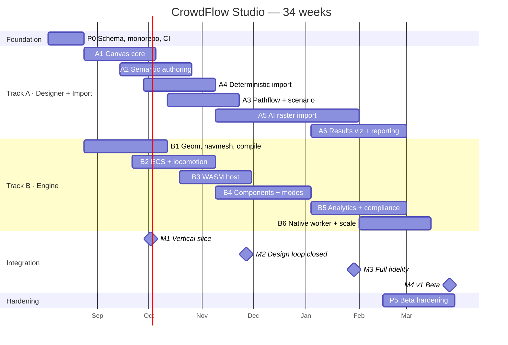

# CrowdFlow Studio — Roadmap, Milestones & Risks

Assumes 4 engineers (see `00-overview.md` A1) and a start of **2026-08-03**. Effort is quoted in
**engineer-weeks** so the calendar can be re-cut for a different team size.

---

## 1. Phase table

| Phase | Track | Weeks | Effort | Depends on | Output |
|---|---|---|---|---|---|
| **P0** Foundations | Both | W1–W3 | 6 ew | — | `schema/`, monorepo, CI, fixtures, codegen |
| **A1** Canvas core | A | W3–W8 | 6 ew | P0 | Draw/edit/undo/layers/snap |
| **B1** Geometry + navmesh + compiler | B | W3–W9 | 7 ew | P0 | `VenueDoc → NavGraph` |
| **A2** Semantic authoring + components | A | W7–W12 | 6 ew | A1, B1 (warnings) | Zones, openings, component library, validation panel |
| **B2** ECS + locomotion | B | W8–W14 | 7 ew | B1 | SFM+PBD, 25k agents native |
| **A4** Deterministic import | A | W9–W14 | 6 ew | A1 | DXF/vector-PDF/SVG → draft venue |
| **A3** Pathflow + scenario authoring | A | W11–W16 | 5 ew | A2 | Routing graph, arrival curves, populations |
| **B3** WASM host | B | W12–W17 | 5 ew | B2 | In-browser sim, SAB, threads, fallback |
| **A5** AI raster import | A | W15–W26 | 12 ew | A4 | Segmentation, symbols, OCR, VLM pass |
| **B4** Components + modes + behaviour | B | W15–W22 | 7 ew | B2, A2 | Queues, groups, evacuation mode, events |
| **B5** Analytics + compliance | B | W21–W28 | 8 ew | B4 | Heatmaps, bottlenecks, NFPA/Green Guide |
| **A6** Results viz + reporting | A | W21–W28 | 7 ew | B5, A3 | Overlays, charts, PDF dossier, BOM |
| **B6** Native worker + scale | B | W25–W32 | 6 ew | B5 | 250k agents, Monte Carlo, sweeps |
| **P5** Hardening + beta | Both | W29–W34 | 10 ew | all | Perf, a11y, docs, onboarding, pilot users |

Cross-cutting, running throughout: backend/API/infra (~14 ew), design (~part-time),
V&V (`06-validation.md`, ~6 ew, front-loaded into B2/B4/B5).

**Total ≈ 112 engineer-weeks ≈ 34 calendar weeks at 4 engineers**, including overhead.

---

## 2. Integration milestones

These are the only dates that matter. Each is a demo, not a status report.

### M1 — Vertical slice · end of W9 · **2026-10-02**

> Draw a rectangular hall with two doors in the canvas → it compiles to a navmesh →
> 500 agents spawn and walk out → you watch them move.

Proves: schema contract works, compiler works, the WASM bridge works, the renderer works.
Thin but end-to-end. If M1 slips, everything slips — treat it as the project's real deadline.

### M2 — Design loop closed · end of W17 · **2026-11-27**

> Import a real DXF → map layers → confirm scale → review and accept → add turnstiles and a
> queue area → author an arrival curve → run 10,000 agents in the browser at 60 fps → watch a
> live density heatmap form at the entrance.

Proves: the product's core loop. This is the first version worth showing to a prospective user
or a review committee. **Target this for the first academic checkpoint / demo.**

### M3 — Full fidelity · end of W26 · **2027-01-29**

> Import a scanned raster plan → AI-assisted review → two floors with a stair → security
> checkpoints with realistic queues → evacuation mode with alarm at t=80min → bottleneck
> ranking → NFPA 101 and Green Guide pass/fail with clause citations.

Proves: every headline capability from the source documents exists.

### M4 — v1 Beta · end of W34 · **2027-03-26**

> A pilot user, unsupervised, imports their own venue, runs a 60,000-agent peak-load scenario
> on the server, compares it against a baseline version, and exports a compliance dossier they'd
> be willing to hand to a licensing authority.

Proves: it's a product. Gate for public beta and for the first paper submission.

---

## 3. Dependency graph

**Critical path:** P0 → B1 → B2 → B3 → B4 → B5 → A6 → P5. Track A's A5 (AI import) is the
longest single phase but is *not* on the critical path — because A4 ships a working import
first. This is why A4-before-A5 is the right sequencing.

---

## 4. Risk register

Ordered by expected loss (probability × impact).

| ID | Risk | P | Impact | Mitigation | Trigger / early warning |
|---|---|---|---|---|---|
| **R-01** | Dense-crowd instability: agents jitter, overlap, or explode at choke points — exactly the regime the product exists for | High | Critical | SFM+PBD hybrid from the start (`04` §B2), not SFM alone. RiMEA congestion cases as an early gate in B2, not in B5. | Fundamental diagram diverges from Weidmann above 3 p/m² |
| **R-02** | Topology repair fails on real-world messy plans → import output needs so much correction users abandon it | High | High | A4 before A5; tolerance slider with live preview; per-element confidence; make manual correction genuinely fast (A1 quality matters here). Measure *correction time*, not just IoU. | Median correction time > 20 min on the real-plan fixture set |
| **R-03** | AI import accuracy plateaus below usefulness (CubiCasa is residential-biased; our domain is assembly venues) | Med | High | Synthetic venue generator (A5.2) is the primary mitigation and is scheduled first. Active-learning loop from user corrections. Fall back to "AI as assist on a manual trace" framing. | Wall IoU < 0.80 on held-out real assembly plans after A5.3 |
| **R-04** | Compliance engine is confidently wrong → reputational and legal exposure | Med | Critical | Hand-worked fixture per rule; external review by a fire-safety engineer before any rule ships; verification statement + engine version on every report; explicit decision-support disclaimer. | Any rule without a reviewed fixture reaching `main` |
| **R-05** | Cross-origin isolation unavailable in a user's environment → no threads, 4× lower ceiling | Med | Med | Single-threaded fallback built and tested from B3, not retrofitted. Non-isolated subdomain for third-party widgets. | Telemetry shows > 10% of sessions non-isolated |
| **R-06** | Determinism breaks quietly and the browser preview disagrees with the server report | Med | High | CI gate G2 across three targets from B2. `libm` everywhere, ordered reductions, banned APIs enforced by lint. | Any G2 failure — treat as a build-breaking bug, never as flaky |
| **R-07** | DWG support: no permissively-licensed reader. ODA File Converter has redistribution limits; LibreDWG is GPL | Med | Med | v1 supports **DXF natively**; DWG via server-side ODA conversion under its own terms, isolated in one container. Document DWG as "converted on our servers" not "supported in-browser". Revisit with a commercial ODA SDK licence at revenue. | Legal review flags redistribution before beta |
| **R-08** | Scope creep from the deck (LLM agents, digital twin, 3D) pulls effort off v1 | High | Med | Explicit non-goals (`00-overview.md` §3) plus designed-for-later seams (`01-architecture.md` §9) so deferring costs nothing architecturally. Say no with a plan, not with a shrug. | Any seam item appearing in a sprint before M4 |
| **R-09** | Browser memory ceiling: 100k agents + meshes + density grids exceed WASM's addressable memory on 32-bit `wasm32` (4 GB, practically ~2 GB) | Med | Med | Memory budget tracked in the perf gate; density grids at u8; cohort sampling; LOD. Evaluate `memory64` when browser support is broad. Server path exists for the big runs. | Peak heap > 1.2 GB at 50k agents |
| **R-10** | Free-tier infrastructure limits block development (see `07-infrastructure-and-cost.md`) | Med | Med | Self-host the always-on services on Oracle Always Free ARM; CPU-first ONNX inference; Kaggle/Colab for training. Every service has a named paid successor so migration is a config change. | Any service hitting > 70% of its free quota |
| **R-11** | ML model licences (Ultralytics AGPL, SegFormer weights, CubiCasa5K terms) are incompatible with commercialisation | Med | High | Licence audit *before* training (`07` §5). Use RT-DETR/YOLOX over Ultralytics; permissive backbones; treat CubiCasa as academic-only and plan a licence-clean replacement set. | Any AGPL/NC dependency reaching the product path |
| **R-12** | Single-person key-knowledge concentration on the Rust engine | Med | High | Pair on B1/B2; ADRs for every non-obvious decision; `cf-testkit` as executable documentation. | Bus factor of 1 on any crate at M2 |
| **R-13** | Renderer can't hit 60 fps with agents + heatmap + editor chrome simultaneously | Low | Med | Instanced rendering from SAB, one draw call; heatmap as a shader on a texture; profile at A1 not A6. | < 45 fps at 20k primitives during A1 acceptance |

---

## 5. Team and ownership

| Role | Owns | Phases |
|---|---|---|
| Rust / systems | `engine/*`, determinism, performance gates | B1–B6 |
| Frontend / graphics | `web/*`, canvas, renderer, overlays | A1, A2, A3, A6 |
| ML / CV | `services/import-worker`, `ml/*` | A4 (CV parts), A5 |
| Full-stack / infra | `services/api`, deployment, storage, CI, report worker | P0, cross-cutting, A6 (report) |

**Shared, no single owner:** `schema/` and `fixtures/` — changes require review from both track
leads (CI gate G1). This is deliberate: the contract belongs to the project, not to a person.

Practices: ADRs in `docs/adr/` for every decision that would be expensive to reverse; weekly
integration demo against a fixture (not a slide); trunk-based with short-lived branches; the
perf and determinism gates are non-overridable.

---

## 6. Academic deliverables mapped onto the plan

The source documents identify publication and IP targets. Mapping them to phases so they're
byproducts of the engineering rather than extra work:

| Output | Depends on | Ready by | Venue |
|---|---|---|---|
| **Paper 1** — Rust/WASM + ECS with zero-copy `SharedArrayBuffer` handoff for browser-scale agent simulation. Contribution: the determinism-across-targets methodology (`04` §5) is genuinely novel and publishable. | B2, B3, perf data from B6 | after M3 | Computer Graphics Forum, IEEE TVCG (short), or a WebGraphics/Web3D venue |
| **Paper 2** — Hybrid VLM-semantics + classical-topology pipeline for converting legacy raster floor plans into topologically closed simulation meshes. Contribution: the honest separation of geometry (CV) from judgement (VLM), with correction-time as the metric. | A4, A5, eval set | after M3 | MDPI *Applied Sciences*, *Journal of Computing in Civil Engineering*, *Automation in Construction* |
| **Paper 3 (optional)** — V&V of a browser-based evacuation model against RiMEA/ISO 20414. | B5, `06-validation.md` | after M4 | *Fire Safety Journal*, *Safety Science* |
| **Patent scope 1** — Automated environment generation: raster sequence modelling + algorithmic topological gap-closing → multi-agent navigation mesh. Differentiate carefully from EP4242587B1. | A4 + A5 | file at M3 | Provisional first |
| **Patent scope 2** — Browser-based simulation memory architecture (worker + SAB alignment for client-side 100k-agent density rendering). **Novelty here is thin** — SAB double-buffering is prior art. If pursued, claim the *specific* combination with deterministic cross-target reproduction, which is defensible. | B3, B6 | assess at M4 | Get a patent attorney's view before spending; consider defensive publication instead |

Recommended sequencing for an academic timeline: **M2 = mid-project review demo**,
**M3 = paper submissions + provisional filing**, **M4 = final defence + beta launch**.
