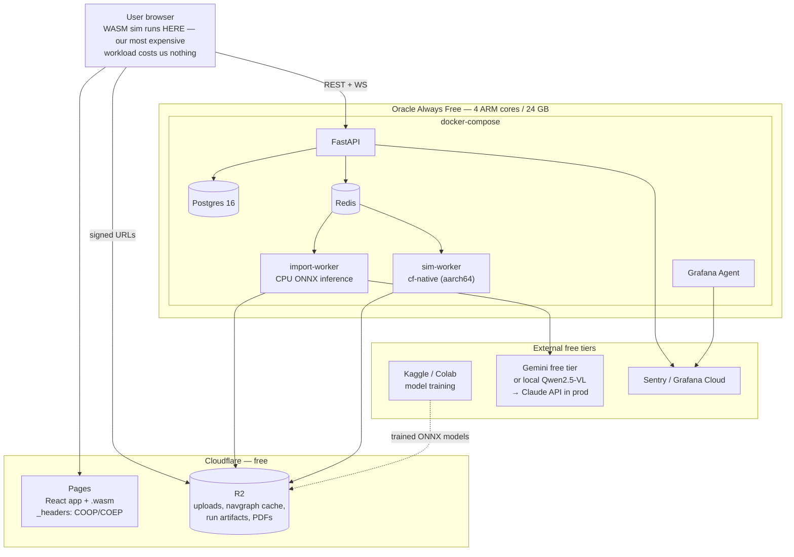

# Infrastructure, Free-Tier Strategy & Licensing

**Constraint:** this is an academic project that must run at **≈₹0 / $0 recurring cost**, while
staying on a credible path to commercial deployment. Every choice below is made twice — once for
the free-tier academic build, once for the paid successor — so that migrating is a config change,
never a rewrite.

> **Verify before relying on any number here.** Free-tier limits change frequently and without
> notice (Fly.io removed its free VM allowance; Heroku removed free dynos entirely). Re-check
> each provider's current terms at signup, and treat §2 as a starting shortlist rather than a
> guarantee.

---

## 1. Principles

1. **Self-host the always-on things on one generous free VM.** Managed free tiers are individually
   small and collectively a lot of accounts to babysit. One always-free VM running
   docker-compose beats six free tiers.
2. **Scale-to-zero for the bursty things.** Import jobs and sim jobs are bursty; pay (in free
   quota) only when they run.
3. **Push compute to the client.** The architecture already does this — the simulation runs in
   the user's browser via WASM. This is not only a performance decision, it is the reason the
   product's most expensive workload costs us nothing. Lean into it.
4. **No provider-specific APIs.** S3-compatible object storage, standard Postgres, standard
   Redis, OCI containers. Nothing that can't be pointed elsewhere with an env var.
5. **Design for CPU inference.** If the ML pipeline requires a GPU to serve a request, it can't
   run on a free tier. Train on free GPU, **serve on CPU with quantized ONNX.**

---

## 2. Service selection

### 2.1 Recommended free-tier stack

| Need | Free choice | Allowance (verify) | Paid successor |
|---|---|---|---|
| **Always-on backend host** | **Oracle Cloud Always Free** — ARM Ampere A1 VM | ~4 OCPU / 24 GB RAM / 200 GB block storage, permanently free | Hetzner CX/CAX (~€4–15/mo) → AWS/GCP |
| **Frontend + WASM hosting** | **Cloudflare Pages** | Unlimited bandwidth, 500 builds/mo, **custom headers via `_headers`** | Cloudflare Pages Pro |
| **Object storage** | **Cloudflare R2** | 10 GB storage, ~1M writes + 10M reads/mo, **zero egress fees** | R2 paid (still no egress fee) |
| **Postgres** | **Neon** free tier (or self-host on the Oracle VM) | ~0.5 GB storage, autosuspend | Neon paid / managed RDS |
| **Redis (queue + pubsub)** | **Self-host on the Oracle VM** | unlimited | Upstash / ElastiCache |
| **Bursty API / workers** | **Google Cloud Run** free tier | ~2M requests + 360k GB-s/mo, scale-to-zero | Cloud Run paid |
| **ML training GPU** | **Kaggle Notebooks** (primary) + **Google Colab** (interactive) | Kaggle ≈30 GPU-hr/week (T4×2 / P100) | Vast.ai / Lambda spot |
| **ML demo hosting** | **Hugging Face Spaces** | free CPU tier; ZeroGPU for community demos | HF Inference Endpoints |
| **CI/CD** | **GitHub Actions** | unlimited minutes on **public** repos | GH Team minutes |
| **Container registry** | **GitHub Container Registry** | free for public images | GHCR paid |
| **Error tracking** | **Sentry** free (or self-hosted GlitchTip) | ~5k events/mo | Sentry Team |
| **Product analytics** | **PostHog** free cloud or self-hosted Umami | ~1M events/mo | PostHog paid |
| **Metrics/logs** | **Grafana Cloud** free | ~10k series, 50 GB logs | Grafana Pro |
| **Auth** | **Supabase Auth** free, or self-hosted (Better-Auth / Authelia) | ~50k MAU | Clerk / WorkOS |
| **Transactional email** | **Resend** free | ~3k emails/mo, 100/day | Resend paid |
| **VLM inference** | **Google AI Studio (Gemini) free tier** or local **Qwen2.5-VL** via Ollama | rate-limited free tier | **Claude API** (Opus 5 / Sonnet 5) |
| **Domain** | GitHub Student Pack (`.me` free) or `*.pages.dev` | — | any registrar |

### 2.2 Claim these first — you're eligible

As a VIT student this is free money that materially de-risks R-10:

| Programme | What you get |
|---|---|
| **GitHub Student Developer Pack** | GitHub Pro, free domain, DigitalOcean credit, Sentry, and ~100 partner offers. Apply first — several items below are inside it. |
| **Microsoft Azure for Students** | ~$100 credit, no card required, renewable |
| **Google Cloud Research Credits** | Application-based; commonly meaningful credit for a named research project |
| **AWS Cloud Credit for Research** / AWS Educate | Application-based |
| **NVIDIA Academic Hardware Grant** | GPU hardware grant for a supervised research project — worth an application given the ML component |
| **Anthropic / OpenAI research access programmes** | Worth applying for API credit once Paper 2's methodology is defined |
| **JetBrains / Cursor / Figma education licences** | Tooling |

**Action:** apply for these in week 1 of P0. Approvals take weeks; the GPU-hungry phase (A5)
starts at W15.

---

## 3. Deployment topology (free build)



**Why the Oracle ARM VM is the right centre of gravity:**
- 24 GB RAM comfortably runs Postgres + Redis + API + both worker types.
- 4 ARM cores make `cf-native` sim runs genuinely useful (not 250k agents, but 30–50k).
- **aarch64 is already one of our three determinism targets** (`04` §5) — so the free host
  doubles as CI coverage for a target we need anyway. Convenient rather than coincidental.
- Permanently free, not a trial credit that expires mid-semester.

**Caveat:** Oracle Always Free ARM capacity is frequently unavailable in popular regions and
idle instances can be reclaimed. Mitigations: try multiple regions, script the retry, take
**automated Postgres dumps to R2 nightly**, and keep the whole stack in a single
`docker-compose.yml` so re-provisioning is one command. Fallback if capacity never
materialises: Hetzner CAX11 at ~€4/mo — cheap enough to be a rounding error and worth
budgeting for rather than fighting.

---

## 4. Architectural adjustments forced by the free tier

These are real changes to `01-architecture.md`, not caveats.

### 4.1 CPU-first ML inference

**Original:** GPU worker pool for segmentation + detection.
**Free-tier:** train on Kaggle/Colab GPU → export **ONNX** → quantize to INT8 →
serve with ONNX Runtime on the Oracle ARM cores.

Consequences, accepted deliberately:
- Use a **smaller backbone**: SegFormer-B0/B1 rather than B2+, or MobileNetV3-U-Net.
- Tile a sheet and process tiles sequentially; an A1 sheet becomes ~60–120 s instead of ~15 s.
- **The import job is already async with a progress UI**, so a slower job degrades the
  experience but breaks nothing. This is why A4/A5 were designed job-based from the start.
- Revised target: raster import p95 **< 5 min on free tier**, < 90 s once GPU is available.

Keep the GPU path behind the same interface (`InferenceBackend`) so switching is an env var.

### 4.2 VLM provider abstraction

```python
class VlmProvider(Protocol):
    async def analyze(self, image: bytes, candidates: Geometry,
                      schema: type[T]) -> tuple[T, float]: ...
```

- **Academic / free:** Gemini free tier, or local Qwen2.5-VL-7B (quantized, via Ollama) on
  Kaggle for batch labelling.
- **Production:** Claude — Sonnet 5 for bulk sheet analysis, Opus 5 for hard/ambiguous plans.
  Prompt-cache the system prompt and the schema; only the image varies.

Because the VLM only does semantics and validation (`00-overview.md` C1), a weaker free model
degrades label quality — which the user reviews anyway — rather than corrupting geometry.
**The architecture's correction is also what makes the free tier survivable.** Track a per-provider
accuracy score in `ml/evals/` so the quality delta is measured, not assumed.

### 4.3 Server sim capped, browser sim uncapped

The free tier can't do 250k agents. It doesn't need to: **the browser does the work.** Free-tier
server sim caps at ~50k agents / 1 job at a time; the 250k target (B6) is validated on a
borrowed/rented machine for the paper's benchmark table and enabled in production later. Publish
the browser numbers as the product claim, since those are what every user actually gets.

### 4.4 Public repo, private secrets

GitHub Actions is unlimited on public repos. Given the intent to publish papers and possibly
file provisionals, decide deliberately:

- **Recommended:** public repo for `engine/`, `schema/`, `fixtures/`, `docs/` (supports the
  papers, gets free CI, builds credibility); **private** for `ml/` training data and any
  pre-filing patent material.
- File provisionals **before** open-sourcing anything covered by a patent scope — public
  disclosure starts (or forfeits) filing windows in many jurisdictions. Confirm with the
  university's IP office before the first public push.

---

## 5. Licensing audit — do this before writing training code

The single highest-value item in this document for "academic → industry entry". Several
obvious defaults are commercially poisoned, and discovering that after training is expensive.

| Dependency | Licence | Verdict |
|---|---|---|
| **Ultralytics YOLOv8/v11** | **AGPL-3.0** | ⛔ **Avoid.** AGPL reaches a hosted SaaS. Commercial licence required. **Use RT-DETR or YOLOX (Apache-2.0) instead.** Decide this in A5.1, not later. |
| **SegFormer original weights** | NVIDIA source-code licence — **non-commercial** | ⚠️ Architecture via HF `transformers` is Apache-2.0, but the *pretrained weights* are restricted. **Train from a permissive backbone** (DINOv2 / ConvNeXt / timm ImageNet weights) or from scratch on our synthetic set. |
| **CubiCasa5K** | Research-oriented terms — **verify exact licence** | ⚠️ Fine for the papers. Before commercial use, either confirm the licence permits it or rely on the **synthetic generator + our own labelled set** (which A5.2 already builds — this is a second reason it's scheduled first). |
| **ODA File Converter** (DWG→DXF) | Free, **redistribution restricted** | ⚠️ Server-side conversion only, isolated in one container, never bundled with a client. Commercial ODA SDK licence at revenue. See R-07. |
| **LibreDWG** | **GPL-3.0** | ⛔ Viral. Do not link. |
| **PaddleOCR** | Apache-2.0 | ✅ |
| **Tesseract** | Apache-2.0 | ✅ |
| **ezdxf** | MIT | ✅ |
| **pypdfium2 / PDFium** | Apache-2.0 / BSD-3 | ✅ |
| **PixiJS** | MIT | ✅ |
| **spade** (CDT), **rayon**, **wasm-bindgen**, **serde** | MIT / Apache-2.0 | ✅ |
| **Typst** | Apache-2.0 | ✅ |
| **PostgreSQL / Redis** | PostgreSQL licence / **RSALv2+SSPL (Redis ≥7.4)** | ⚠️ Redis relicensed. For self-hosting we're fine; if ever redistributing, use **Valkey** (BSD) instead. |
| **NFPA 101 / Green Guide documents** | **Copyrighted standards** | ⚠️ We may implement the *methods* and cite clauses; we may **not** reproduce substantial text or tables verbatim. Report output cites clause numbers and links, never quotes the standard at length. Get this reviewed. |

**Action item for P0:** add a `licence-check` CI job (`cargo-deny` for Rust, `pip-licenses` +
allowlist for Python, `license-checker` for npm) that fails on any AGPL/GPL/NC dependency
entering the product path. Catching this automatically is cheaper than catching it in diligence.

---

## 6. Cost model across stages

| Stage | Users | Monthly cost | Notes |
|---|---|---|---|
| **Academic build (now → M4)** | team + ~10 pilots | **$0** | Everything in §2.1. Budget a **$5–15/mo fallback** for Hetzner if Oracle capacity fails. |
| **Public beta** | ~200 | **~$30–60** | Managed Postgres, a real VM, small paid VLM budget, Sentry. R2 egress still free — this matters a lot for shipping PDFs and WASM. |
| **Early commercial** | ~2k | **~$300–700** | GPU worker for import (spot/on-demand), autoscaled sim workers, paid Claude usage, support tooling. |
| **Scale** | 20k+ | usage-driven | Dominated by import GPU-seconds and server sim. **Browser-side simulation keeps marginal cost per design-loop iteration near zero — this is a genuine structural margin advantage over any competitor that streams cloud compute.** |

The unit economics are worth stating in any pitch or paper: legacy competitors pay per
simulation because simulation runs on their hardware. CrowdFlow's simulation runs on the
customer's laptop. Our marginal cost per simulation is approximately the cost of serving a
2 MB `.wasm` file — once, cached thereafter.

---

## 7. Bootstrap checklist (P0, week 1)

- [ ] Apply: GitHub Student Pack, Azure for Students, GCP Research Credits, NVIDIA Academic Grant
- [ ] Provision Oracle Always Free ARM VM (try 3+ regions; script the retry loop)
- [ ] `infra/compose.yml`: postgres, redis, minio→R2 shim, api, import-worker, sim-worker, grafana-agent
- [ ] Cloudflare account: Pages project + R2 bucket + `_headers` with COOP/COEP, verified with
      a `crossOriginIsolated === true` smoke test **before A1 starts**
- [ ] Nightly `pg_dump` → R2, with a tested restore
- [ ] GitHub repo (public for `engine/`), Actions CI, GHCR, branch protection with gates G1/G2/G3
- [ ] `licence-check` CI job wired and failing-closed
- [ ] Kaggle + Colab accounts; confirm current GPU quota
- [ ] Decide and document the patent-vs-open-source disclosure plan with VIT's IP office
